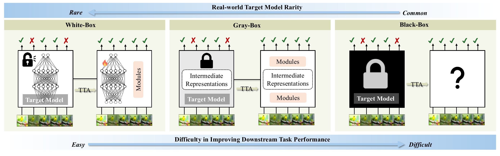
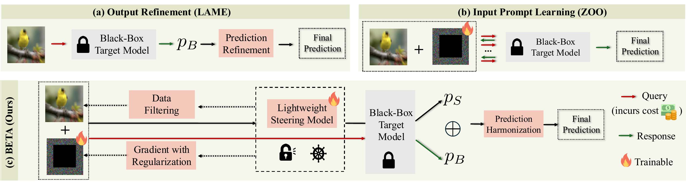

# BETA: Adapting in the Dark. Efficient and Stable Test-Time Adaptation for Black-Box Models

<p align="center">
  🏆 <b>ICLR 2026 TTU Workshop &middot; Oral</b>
</p>


<p align="center">
  <a href="https://openreview.net/pdf?id=v56b8I1tua"></a>
  <a href="https://openreview.net/forum?id=v56b8I1tua"></a>
  <a href="https://yunbeizhang.github.io/BETA/"></a>
  <a href="LICENSE"></a>
</p>
<p align="center">
  <b>Yunbei Zhang, Shuaicheng Niu, Chengyi Cai, Feng Liu, Jihun Hamm</b>
</p>


## News

- **Apr 16, 2026.** Code released.
- 🏆 **Mar 07, 2026.** Selected as **Oral Presentation** at the Third Workshop on Test-Time Updates (TTU).
- **Mar 01, 2026.** Accepted to the Third Workshop on Test-Time Updates (TTU), ICLR 2026 Workshop.

## TODO

- [x] Release code
- [ ] arXiv preprint (coming soon)

## Abstract

<p align="center">
  
</p>

Test-Time Adaptation (TTA) for black-box models accessible only via APIs remains a largely unexplored challenge. Existing approaches such as post-hoc output refinement offer limited adaptive capacity, while Zeroth-Order Optimization (ZOO) enables input-space adaptation but faces high query costs and optimization challenges in the unsupervised TTA setting. We introduce **BETA** (Black-box Efficient Test-time Adaptation), a framework that addresses these limitations by employing a lightweight, local white-box *steering model* to create a tractable gradient pathway. Through a *prediction harmonization* technique combined with *consistency regularization* and *prompt learning-oriented filtering*, BETA enables stable adaptation with no additional API calls and negligible latency beyond standard inference. On ImageNet-C, BETA achieves a **+7.1% accuracy gain on ViT-B/16** and **+3.4% on CLIP**, surpassing strong white-box and gray-box methods including TENT and TPT. On a commercial API, BETA achieves comparable performance to ZOO at **250&times; lower cost** while maintaining real-time inference speed.

## Method Overview

<p align="center">
  
</p>

BETA operates with two models, a powerful frozen black-box target `f_B` and a lightweight local *steering model* `f_S`, and learns an additive visual prompt `δ` that is optimized locally through `f_S`. Because direct gradient transfer between architectures is ineffective, BETA uses **prediction harmonization** to fuse the two outputs into a shared objective. Two stabilizers, namely **consistency regularization** between clean and prompted predictions, and **prompt-learning-oriented filtering**, keep the unsupervised adaptation stable.

## Installation

```bash
git clone https://github.com/yunbeizhang/BETA.git
cd BETA
conda create -n beta python=3.10 -y
conda activate beta
pip install -r requirements.txt
```

## Data Preparation

BETA evaluates on ImageNet-C (Hendrycks & Dietterich, 2019). Download it and set the data roots via the `DATA_DIR` environment variable (see `main.sh`):

```
DATA_DIR/
├── ImageNet/            # original validation set
└── ImageNet-C/          # 15 corruptions × 5 severities
```

Optional domain-shift benchmarks (ImageNet-R / V2 / Sketch / -A) can be placed alongside and passed via `--data_rendition`, `--data_v2`, etc.

## Quick Start

Run BETA with the reference ViT-B/16 configuration:

```bash
bash main.sh
```

## Citation

If you find this work useful, please cite:

```bibtex
@inproceedings{zhang2026adapting,
  title={Adapting in the Dark: Efficient and Stable Test-Time Adaptation for Black-Box Models},
  author={Yunbei Zhang and Shuaicheng Niu and Chengyi Cai and Feng Liu and Jihun Hamm},
  booktitle={Third Workshop on Test-Time Updates (Main Track)},
  year={2026},
  url={https://openreview.net/forum?id=v56b8I1tua}
}
```

## Acknowledgements

Great thanks to the following excellent works, from which this repository draws implementation details and design inspiration:

- [FOA](https://github.com/mr-eggplant/FOA) for the backpropagation-free TTA scaffold (data loaders, baseline trainer, and test-time plumbing around ViT backbones).
- [BayesianLM](https://github.com/tmlr-group/BayesianLM) for reference implementations of visual reprogramming (VR) and label mapping used by our PadPrompter + ProbFuser components.
- [AReS](https://github.com/yunbeizhang/AReS) for patterns around reliable-and-diverse sample filtering that we adapt in the prompt-learning-oriented filter.

We thank the authors for making their code public.

## License

This project is released under the [Apache 2.0 License](LICENSE).
